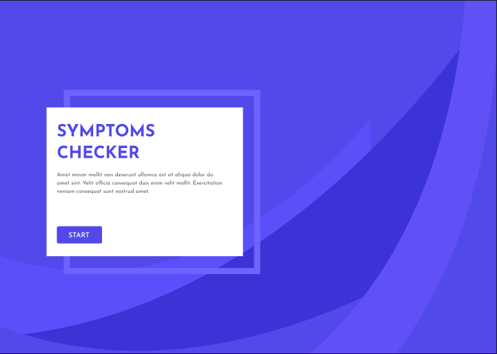

Symtoms Checker v1 is for demonstration purposes only.

In preperation for being built in ReactJS

<ul>
  <li><a href="https://www.figma.com/file/mrpnmaxCeAo1btf859gUfM/Symptom-Checker?node-id=6:437&t=HTicJQQeIxsvv2TF-1" target="_blank">Mock-ups</a></li>
  <li><a href="https://vermillion-bublanina-686402.netlify.app/" target="_blank">Website (Prototype)</a></li>
  <li><a href="https://datastudio.google.com/s/k27oMvC0nvc" target="_blank">Reports Dashbord</a></li>
</ul>

